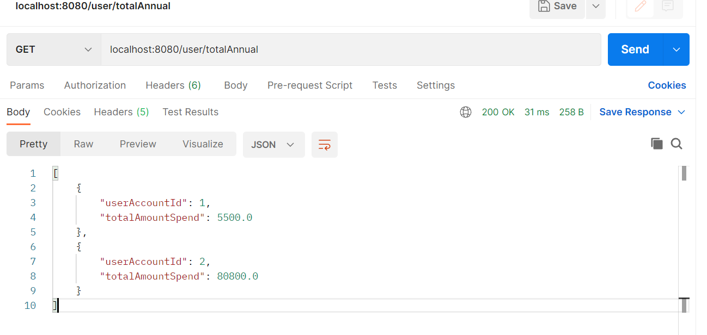
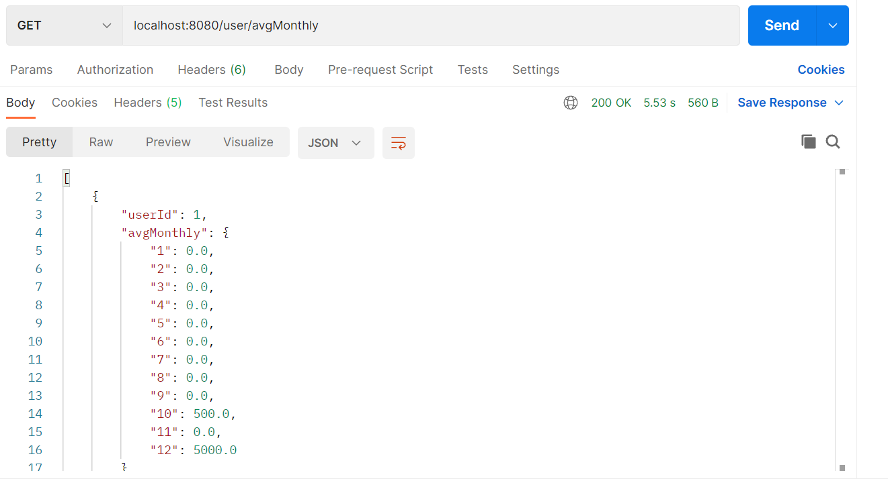

# Getting Started

### Reference Documentation
This application will help us to know the status from the transactions from the users.
This will be through the endpoints that calculate the to calculate the user’s total annual 
spending in the past year and monthly average in the past year.

### Guides
For do this we have in the controller called "UserTransactionController" two 
endpoints which are the next:
* /user/totalAnnual this is a GET request.
* /user/avgMonthly this is a GET request too.

The implementation works as the next way:
* For get the total annual spending transactions by user, first get
  all the transactions from all users, iterate over the list using a
 stream, then call the filter method and validate if the user corresponds at 
 the user that has an account, then get the current date and in base of that date
 get all the rolling year, that means from the same date last year to current date, then 
 I do the sum of all amounts in the year.
 You can execute the service as follows:
 
* For get the average monthly average in the past year, fist sort the array for loop in order it is by user id and
 then by date, get the first user to get a base for start with the loop, then validate if the date that arrives from 
 the list is in the range of the past year, so it does some validations that help to know:
    * If the user is equals at the user base that we get, if not it will be change
      at the current user that arrives in the loop.
    * If the current month is 0 or equals to the current month it allows thar we can add the values at the array
      without affect the values of other months, when this condition do not fulfilled, so with all the results of
      the list an average is taken which is added to a Map that has a dictionary function, the average is added to
    the key that corresponds to the current month
 You can execute the service as follows:
    
    *NOTE: in the response from avg monthly I need to change the number for the name of the month, still.
     And also add the the entity relationship diagram, as well as the entities and connection to the database *
  

