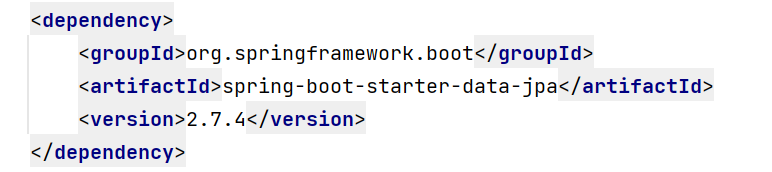
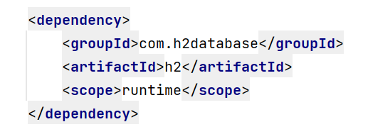
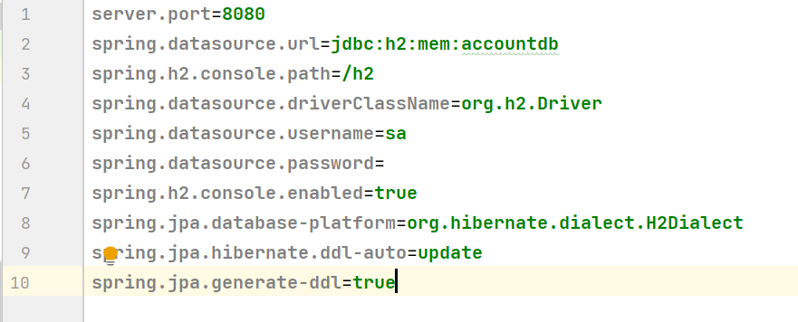
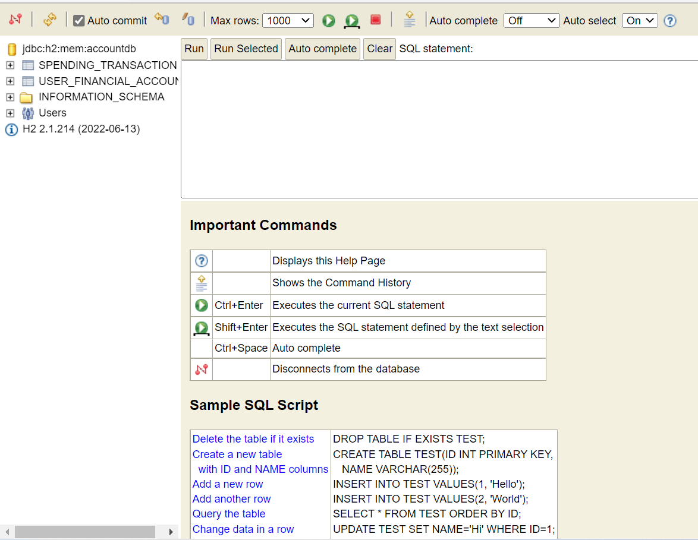
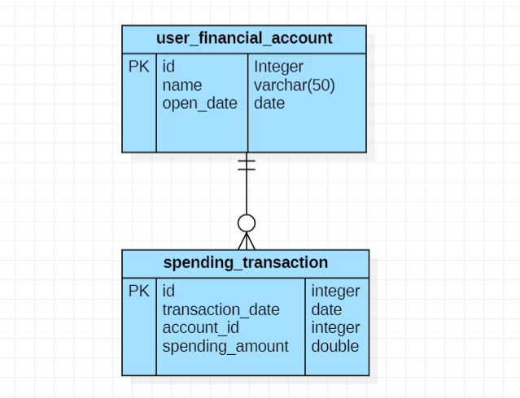

## User Transactions🧮

### Introduction 📝

Good practice in financial planning is to review expenses in the previous year and adjust expenses for the next year.
One part of looking back is to calculate the annual spending and the monthly average in the past year.
The annual expense and the monthly average can be used as a basis for a financial plan.

### Getting started 🚀

The next instructions will allow you to know the working of the project on your local machine for development and testing purposes.

### Pre-requirements 📖

_Things you need to download the project_

* Java 8
* Maven
* IntelliJ or any other development IDE for java that supports maven and Spring Boot.
* Postman

### Running the endpoints 📮

###### Endpoints to use

* ***/user/totalAnnual*** this is a GET request.
  * Properties:
    1. `userAccountId: Integer `-  unique id of a user account.
    2. `totalAmountSpend: Double `- the total amount of transactions in a full year.
* ***/user/avgMonthly*** this is a GET request.
  * Properties:
    1. `userAccountId: Integer` -  unique id of a user account.
    2. `avgMonthly: Map<Integer,Double>`- the monthly average for a full year.
       1. `key: Integer` - month of the year represented by one number. Ex. *1 = Jan*, *2= Feb*...
       2. `value: Double`- the monthly average.

#### Presentation layer 🖨️

This endpoint returns an array of objects, the array contains the user id and the total sum of all transactions for a year.

This is an example of the returning array in Postman.

This endpoint returns an array of objects, each object contains the user id and monthly average of transactions made for a year.

This is an example of the returning array in Postman.

Any service uses any kind of authentication, at the moment.

#### Bussines Layer ✒️

The service layer is based on the following requirements:

* Given a list of a user’s financial accounts and their transactions.
  Make a solution to allow the calculation of the total annual expenses of
  the user in the last year and the monthly average in the last year.

For this there is a service with its respective implementation:

* Transaction Service, this one, just contains two abstract methods.
  * *getUsersTotalAnnualSpending()*, gets the total annual spending transactions by user
  * *getUserMonthlyAverage()*,  gets the monthly average in the past year
* Transaction Service Implementation, which overrides the mentioned methods.

The implementation logic works in a next way:

* Get the total annual spending transactions by user:

  * First all user accounts are obtained, as well as all transactions.
  * Calculate `pastDate ` which is a date from the past year based on the current date, to cover a full year.
  * Gets the user data, is necessary to iterate through the entire list.
  * In the list of transactions, filters by three aspects:
    * By userId,
      selects only the user's transactions from the list and avoids the others that do not correspond to the id.
    * By `pastDate`, bring all the transactions after this date.
    * By `currentDate`, bring all the transactions before this date.
  * Get from the list only the amount for each transaction.
  * And then, the sum of all amounts obtained in the previous step is stored in the `total` variable.
  * In the end, these results are added to this list `userTotalAnnualSpendList`
* This is done for each user.
* Get the average monthly average in the past year:

  * First all user accounts are obtained, as well as all transactions.
  * Calculate `pastDate` which is a date from the past year based on the current date, to cover a full year.
  * `spendingTransactionList` must be ordered by user id and then by date.
  * Get the currentUser and `currentMonth` based on the first item of `spendingTransactionList` since these variables
  * Then a loop is made to iterate the variable spendingTransactionList which is conditioned to the fact that the date
    of the transaction is in the date range.
  * By `pastDate`, bring all the transactions after this date.
  * By `currentDate`, bring all the transactions before this date.
  * Case 1: If this condition is met, we verify that the user is still
    the same to continue storing the monthly averages per user.
  * Otherwise it means that the transactions of currentUser have finished and the following must be done:
    * The average of the last month is calculated, and it is saved in our `month's map`, in which it is indicated that
      the key will be the `currentMonth` and the value the result of the average.
    * The averages saved in `months` are stored in `userMonthlyAvgList`
      these are the averages of the currentUser.
    * We reset the variables, which indicates that we have to  count the averages of a new user:
      * `currentUser`, with the new user of the current transaction.
      * `currentMonth` to 0
      * `amountByMonth` with a new fix
      * `months` with a catalog of months but with the values empty.
  * Case 2: Indicates that it is still the same month or that it has been initialized a new user and the amount of
    the current transaction must be added to the amountByMonth array.
    * If it is the last transaction, it means that you have to calculate the
      running average, add it to `months` catalog and finally add it to the `userMonthlyAvgList`.
  * Case 3: when the month changes, the cumulative average of the currentMonth must be calculated and added to the
    `month`'s catalog. Also, the first transaction of the new month is saved as well as the new month
    in the corresponding variables.
  * For each lap, the start is being increased to know when the end is and that the average of the last
  * current month can be saved this is `idx`.
  * At the end just return the `userMonthlyAvgList`.

#### Persistence layer 🔁

JPA and Hibernate are being used to map the Java classes to database tables and data persistence.
To use both is necessary to add the next dependency at the POM.xml.

There are only two entities, which are:

* *Spending Transaction Entity:* which contains all the transactions that the users made.
* *User Financial Account Entity*: which contains all the user accounts.
  They have their own repositories.
* S*pending Transaction Repository*
* *User Financial Account Repository*

#### Database layer 💾

For database is using h2, which is a memory database, which means that is available
while the spring boot application is up.
The data can be uploaded if is added to the project as an SQL file, with the insertion statements or the
creation of the tables. In this project, the file is called **data.sql**
To use this one is necessary to add the h2 dependency to the POM.xml file

Also, it is necessary, to add the configurations to the application properties file, in which we specify the data source, the username, etc.

The interface of the database is the next:

And this is the entity relationship diagram, to give us an idea of how the tables are related:

## Deployment 💻

This application actually only runs on a local machine.

For run could use the following command from *MAVEN*:

`mvn spring-boot:run`

## Build with 🛠️

_With the next tools built the project_

* [Spring](https://start.spring.io/) - Framework used
* [Maven](https://maven.apache.org/) - Dapendency managment
